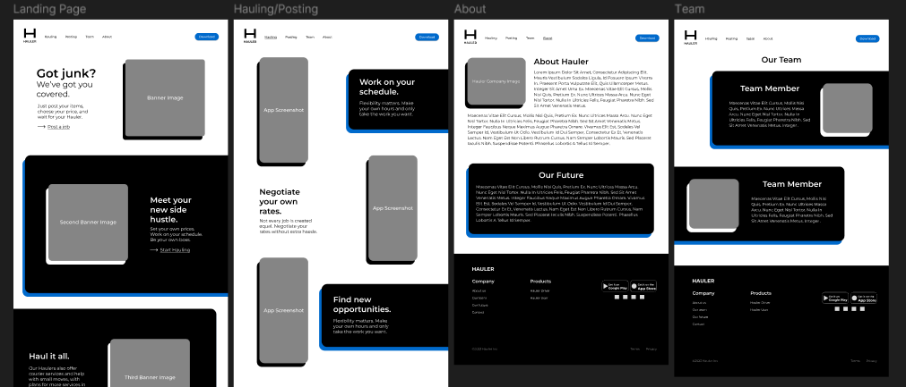

Hauler is an upcoming peer-to-peer app that allows users to request and provide junk removal, moving and courier services. I was responsible for developing their web-funnel from start to finish.

I designed highly-detailed, sleek wireframes and prototypes using Figma. In order to complete the wireframe, I conducted market research and worked with the client to iterate on the initial designs.

The site itself is built with React and styled with Sass. Contact forms are handled through Formspree. The website is hosted on Railway.

While this project was purely frontend, I learned a lot about the design process, and how to apply client feedback quickly and accurately.
